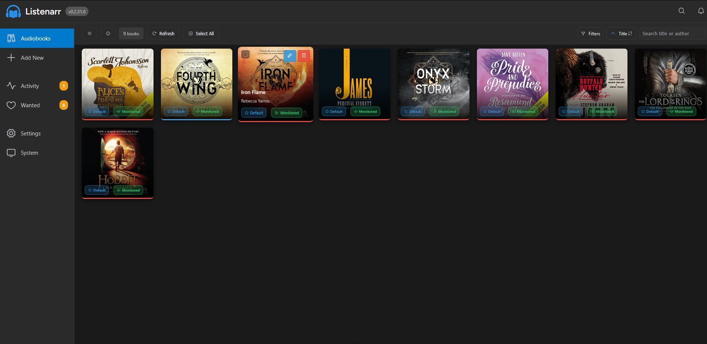

<p align="center">
  
</p>

<p align="center">
  <strong>Automated Audiobook Collection Management</strong>
</p>

<p align="center">
  <a href="https://github.com/therobbiedavis/Listenarr/releases"></a>
  <a href="LICENSE"></a>
  <a href="https://github.com/therobbiedavis/Listenarr/releases"></a>
  <a href="https://github.com/therobbiedavis/Listenarr/pkgs/container/listenarr"></a>
  <a href="https://hub.docker.com/r/therobbiedavis/listenarr"></a>
</p>

---

Listenarr is a fast, feature-rich, cross-platform audiobook management server. Built with a focus on being a complete solution for all your audiobook downloading needs. Set up your own server and get ready to streamline your audiobook listening!

<p align="center">
  <a href="https://github.com/therobbiedavis/Listenarr/tree/canary/preview-images">
    
  </a>
</p>

## What Listenarr Provides

- [x] **Serve up Audiobooks** from multiple sources (torrents, NZBs) with support for various formats (MP3, M4A, M4B, FLAC, AAC, OGG, OPUS)
- [x] **First-class responsive web interface** that works great on any device (phone, tablet, desktop)
- [x] **Rich metadata support** with automatic enrichment from Audible and Amazon
- [x] **External API integration** for searching across multiple torrent and NZB indexers simultaneously
- [x] **Download management** with support for popular clients (qBittorrent, Deluge, Transmission, SABnzbd, NZBGet)
- [x] **Real-time monitoring** of download progress and status
- [x] **Intelligent file organization** with customizable naming patterns
- [ ] **Full localization support** Soon™️

To see what's coming up, check out our [Roadmap](#roadmap)! If you have a suggestion or feature request, please submit them in [Discussions](https://github.com/therobbiedavis/Listenarr/discussions)

## Support

[](https://discord.gg/CwZ2Sqp9NF) [](https://github.com/therobbiedavis/Listenarr/issues)

Join our community on Discord for help, announcements, and discussion: https://discord.gg/CwZ2Sqp9NF

## Setup

The easiest way to get started is to use Docker (recommended for production), pre-built executables, or npm scripts:

### Docker (Recommended for Production)

> **Container images:** GHCR is the preferred registry for Listenarr. Use `ghcr.io/therobbiedavis/listenarr:<tag>` for the latest builds. A Docker Hub mirror (`docker.io/therobbiedavis/listenarr:<tag>`) is still published for backwards compatibility.

```bash
docker run -d \
  ## Replace with your desired UID and GID
  --user 1001:1001 \
  --name listenarr \
  -p 5000:5000 \
  ## OPTIONAL: Used by Discord Bot
  -e LISTENARR_PUBLIC_URL=https://your-domain.com \
  -v listenarr_data:/app/config \
  ghcr.io/therobbiedavis/listenarr:canary
```

**Service will be available at:**
- Web App: http://localhost:5000

**Available Tags (GHCR + Docker Hub mirror):**
- ~~`latest` / `stable`~~ - Latest stable release (available soon)
- `canary` - Latest canary build (pre-release)
- `canary-X.Y.Z` - Specific canary version
- `nightly-X.Y.Z` - Specific nightly version
- `X.Y.Z` - Specific release version

**Docker Compose (Recommended):**
```yaml
version: '3.8'
services:
  listenarr:
    image: ghcr.io/therobbiedavis/listenarr:canary
    user: "1001:1001"  ## Replace with your desired UID and GID
    ports:
      - "5000:5000"
    environment:
      - LISTENARR_PUBLIC_URL=https://your-domain.com ## OPTIONAL: Used by Discord Bot
    volumes:
      - listenarr_data:/app/config
    restart: unless-stopped

# For Docker Hub, replace the image with docker.io/therobbiedavis/listenarr:canary

volumes:
  listenarr_data:
```

### Pre-built Executables

**Download the latest release** from [GitHub Releases](https://github.com/therobbiedavis/Listenarr/releases) and extract the archive for your platform.

#### Windows
```cmd
cd .\listenarr-win-x64
.\Listenarr.Api.exe
```

#### Linux
```bash
cd ./listenarr-linux-x64
chmod +x Listenarr.Api
./Listenarr.Api
```

#### macOS
```bash
cd ./listenarr-osx-x64  # or osx-arm64 for Apple Silicon
chmod +x Listenarr.Api
./Listenarr.Api
```

**Prerequisites:**
- **Node.js 20.x or later** (required for Discord bot functionality)
- Set environment variable: `LISTENARR_PUBLIC_URL=https://your-domain.com`

**Service will be available at:**
- Web App: http://localhost:5000

**Note:**
- Pre-built executables are self-contained and include all dependencies
- Override port with: `--urls "http://localhost:5656"`
- For production, set `LISTENARR_PUBLIC_URL` to your actual domain

### Production Deployment (Advanced)

For custom deployments or when you need to build from source:

**Prerequisites:**
- .NET 8.0 Runtime or later (for framework-dependent deployments)
- Node.js 20.x or later (for Discord bot)
- Set `LISTENARR_PUBLIC_URL` environment variable to your production domain

**Option 1: Use Self-Contained Executables (Recommended)**
```bash
# Build self-contained executable for your platform
dotnet publish listenarr.api/Listenarr.Api.csproj -c Release -r win-x64 --self-contained
cd ./bin/Release/net8.0/win-x64/publish
./Listenarr.Api.exe
```

**Option 2: Framework-Dependent Deployment**
```bash
# Requires .NET Runtime installed on target system
dotnet publish listenarr.api/Listenarr.Api.csproj -c Release
cd ./bin/Release/net8.0/publish
dotnet Listenarr.Api.dll
```

**IIS Deployment (Windows):**
1. Install ASP.NET Core Hosting Bundle
2. Copy published files to IIS site directory
3. Set environment variable in IIS Manager or web.config
4. Ensure Node.js is installed on the server

**Service will be available at:**
- Web App: http://localhost:5000 (or your configured port)
LISTENARR_URL=http://localhost:5000 node index.js
### Manual Setup

If you prefer to run the services separately:

**Prerequisites:**
- .NET 8.0 SDK or later
- Node.js 20.x or later

**Install dependencies:**
```bash
npm run install:all  # Install frontend dependencies
```

**Start development servers:**
```bash
npm run dev          # Start both API and Web (recommended)
# OR run separately:
npm run dev:api      # Start only backend API
npm run dev:web      # Start only frontend web
```

**Services will be available at:**
- Backend API: http://localhost:5000
- Frontend Web: http://localhost:5173

## Discord bot (optional)

Listenarr includes a small reference Discord bot (in `listenarr.api/tools/discord-bot`) that registers a slash command and forwards requests to the running Listenarr API. The bot is optional — the preferred integration is configuring the Discord settings from the Listenarr UI so the server manages the registration for you. Use the steps below for local development or to run the bot separately.

Prerequisites:
- A running Listenarr instance (see steps above)
- Node.js 20+ and npm
- A Discord application with a bot token and application ID

Quick start (development):

1. Create a Discord application and bot at https://discord.com/developers/applications. Copy the Application (client) ID and the Bot Token.
2. Invite the bot to your guild with the following OAuth2 URL (replace <APP_ID>):

```text
https://discord.com/oauth2/authorize?client_id=<APP_ID>&scope=bot%20applications.commands&permissions=27648
```

The `permissions=27648` value requests the View Channels, Send Messages, Manage Messages, and Embed Links permissions which is the bare minimum permissions needed for the bot to function.

3. Configure Listenarr (recommended):

- Open the Listenarr web UI and go to Settings → Integrations → Discord (or the Discord section in Configuration).
- Set the **Discord Application ID** to the Application ID you copied.
- Set the **Discord Bot Token** to the bot token you copied.
- Optionally set **Discord Guild ID** and **Discord Channel ID** so the bot registers commands in a specific guild and limits responses to one channel.
- Enable the Discord integration and Save.

When the Listenarr server has the bot token and application ID saved, the server will register the slash command and manage the bot. The `listenarr.api/tools/discord-bot` helper is provided for local development or troubleshooting.

Run the bot standalone (development):

```bash
cd listenarr.api/tools/discord-bot
npm install
# Point the helper at your running Listenarr instance (defaults to http://localhost:5000)
LISTENARR_URL=http://localhost:5000 npm start
```

Windows (PowerShell):

```powershell
cd listenarr.api\tools\discord-bot
npm install
$env:LISTENARR_URL = 'http://localhost:5000'
npm start
```

Notes and troubleshooting:
- The helper bot reads settings from the Listenarr API; configuring the settings in the Listenarr UI is the recommended path.
- For antiforgery (CSRF) support the helper tries to use `fetch-cookie` + `tough-cookie` if installed — install them to avoid occasional CSRF errors:

```bash
npm install fetch-cookie tough-cookie
```

- If you see permissions errors when deleting messages, ensure the bot has **Manage Messages** in the configured channel or invite it again with the proper permissions.
- The helper borrows ephemeral replies (application interaction tokens) to remove ephemeral messages; this is best-effort and may not work across restarts.

Auto-persist Listenarr URL
---------------------------

To make the helper easier to run, it will automatically persist the Listenarr base URL when first started interactively. Order of precedence:

1. `LISTENARR_URL` environment variable (explicit)
2. `listenarr.api/tools/discord-bot/.env` file with `LISTENARR_URL=` (created automatically on first run)
3. Interactive prompt on first run (saved to `.env`)
4. Fallback `http://localhost:5000`

This means you can run the helper once and enter your public domain (for example `https://listenarr.example.com`) when prompted. The URL is saved to `listenarr.api/tools/discord-bot/.env` so you don't need to export environment variables on subsequent runs.


## CI/CD

Listenarr uses GitHub Actions for automated building and deployment:

- **Canary Builds** (on `canary` pushes): Builds self-contained executables (Linux x64, Windows x64) and publishes container images tagged `canary` / `canary-X.Y.Z` to GHCR & Docker Hub.
- **Nightly Builds** (on `develop` pushes): Builds self-contained executables (Linux x64, Windows x64) and publishes container images tagged `nightly` / `nightly-X.Y.Z` to GHCR & Docker Hub.
- **Release Builds** (on version tags): Builds executables for Linux x64, Windows x64, and macOS x64. Creates GitHub releases and publishes container images tagged `stable`, `latest`, and `X.Y.Z` to GHCR & Docker Hub.

All workflows push to `ghcr.io/therobbiedavis/listenarr` and `docker.io/therobbiedavis/listenarr`.

Version numbers are automatically incremented:
- Canary: Patch version +1
- Nightly: Minor version +1, patch reset to 0
- Release: Major version +1, minor and patch reset to 0

All builds are CI-first: `dotnet publish` automatically builds the frontend and includes it in the API's `wwwroot`.

## Feature Requests

Got a great idea? Throw it up on [Discussions](https://github.com/therobbiedavis/Listenarr/discussions) or vote on another idea. Many great features in Listenarr are driven by our community.

## Notice

⚠️ Listenarr is being actively developed and should be considered **beta software**. The platform may be subject to changes as it is being built out. You may experience data loss and need to restart. The Listenarr team strives to avoid any data loss, but please maintain backups of important data.

## Technology Stack

### Backend
- **ASP.NET Core** - Web API framework
- **Entity Framework Core** - Database ORM with SQLite
- **C# 12** with .NET 8.0+

### Frontend
- **Vue 3** - Progressive JavaScript framework
- **TypeScript** - Type-safe development
- **Pinia** - State management
- **Vite** - Lightning-fast build tool
- **Phosphor Icons** - Beautiful icon library

## Project Structure

```
Listenarr/
├── listenarr.api/              # C# Backend API
│   ├── config/                 # User configuration and data
│   │   ├── appsettings/        # Application configuration files
│   │   ├── cache/              # Image cache storage
│   │   ├── database/           # SQLite database files
│   │   ├── logs/               # Application log files
│   │   └── temp/               # Temporary download storage
│   ├── Controllers/            # API Endpoints
│   ├── Models/                 # Data Models
│   ├── Services/               # Business Logic
│   ├── Dockerfile.runtime      # Runtime Docker image for combined API + frontend
│   ├── Program.cs              # Entry Point
│   └── ...
├── fe/                         # Vue.js Frontend
│   ├── src/
│   │   ├── components/         # Vue Components
│   │   ├── views/              # Pages
│   │   ├── stores/             # Pinia Stores
│   │   └── services/           # API Services
│   └── public/                 # Static Assets
├── docker-compose.yml          # Docker Configuration
└── README.md
```

## Configuration

### API Sources

Configure your search APIs in the Settings page:

- Multiple torrent/NZB indexer support
- API key management
- Priority-based search ordering
- Connection testing

### Logging Configuration

You can control the application logging level in three ways:

- Environment variable (recommended for Docker): set LISTENARR_LOG_LEVEL to one of Verbose, Debug, Information, Warning, Error, Fatal (e.g., `LISTENARR_LOG_LEVEL=Debug`).
- Configuration file: create or edit `appsettings.json` or `appsettings.Development.json` in the `listenarr.api` project (or the `config/appsettings` directory when running the container). Set either `Serilog:MinimumLevel:Default` or `Logging:LogLevel:Default` to the desired level.
- Runtime args / orchestration: pass environment variables via `docker run -e LISTENARR_LOG_LEVEL=Debug` or `docker-compose` environment section.

Docker users: the provided `docker-compose.yml` includes an example `LISTENARR_LOG_LEVEL` entry; for non-Docker users changing `appsettings.Development.json` before starting the app is the easiest way to set a custom default logging level.


### Download Clients

Supported download clients:

- **qBittorrent** - Popular torrent client with web UI
- **Transmission** - Cross-platform torrent client
- **SABnzbd** - Usenet downloader
- **NZBGet** - Efficient usenet client

### Application Settings

- Custom output paths and file organization
- Configurable naming patterns
- Automatic metadata fetching
- Library management options

## API Endpoints

### Search
- `GET /api/search?query={query}` - Search all configured APIs
- `POST /api/search/audible?query={query}` - Search Audible metadata

### Library
- `GET /api/library` - Get all audiobooks
- `GET /api/library/{id}` - Get specific audiobook
- `POST /api/library` - Add audiobook
- `PUT /api/library/{id}` - Update audiobook
- `DELETE /api/library/{id}` - Remove audiobook

### Configuration
- `GET /api/configuration` - Get all settings
- `POST /api/configuration` - Save settings

For complete API documentation, see our [API Reference](https://github.com/therobbiedavis/Listenarr/wiki/API) (coming soon).

## Development

### Prerequisites

- .NET 8.0 SDK or later
- Node.js 20.x or later
- npm (comes with Node.js)

### Available Commands

```bash
npm run dev          # Start both API and Web
npm run dev:api      # Start only backend API
npm run dev:web      # Start only frontend web
npm run build        # Build both for production
npm run test         # Run frontend tests
```

### Building for Production

**Backend:**
```bash
cd listenarr.api
dotnet publish -c Release
```

**Frontend:**
```bash
cd fe
npm run build
```

### CI-first monorepo build

The repository is configured so the API publish will build the frontend and copy the `fe/dist` output into the API `wwwroot`. This produces a single publish artifact that serves both backend and frontend.

To build locally (requires Node + npm):

```bash
# from repo root
dotnet publish listenarr.api/Listenarr.Api.csproj -c Release -o ./publish/local
```

If you want to skip the frontend build (no Node on host):

```bash
dotnet publish listenarr.api/Listenarr.Api.csproj -c Release -o ./publish/local /p:SkipFrontendBuild=true
```

To build a runtime Docker image from the publish output (CI-first):

```bash
# context: listenarr.api/publish/<rid>
docker build -f listenarr.api/Dockerfile.runtime -t <your-image> listenarr.api/publish/linux-x64
```

### Version Management

Application versions are managed in `listenarr.api/Listenarr.Api.csproj` with a `<Version>` element. CI automatically bumps versions on builds:
- Nightly: Increments patch (e.g., 1.2.3 → 1.2.4)
- Release: Increments minor and resets patch (e.g., 1.2.3 → 1.3.0)

Bumped versions are persisted via PR to maintain branch protection.


## Roadmap

- [x] User authentication and authorization
- [x] Real-time WebSocket updates for downloads
- [x] Advanced search filters
- [x] Notification system (email, webhooks, Discord)
- [ ] Smart Collections and Reading Lists
- [ ] Progress Scrobbling and Syncing
- [ ] Audiobookshelf integration
- [ ] Multi-language support
- [ ] Backup and restore functionality
- [ ] Plugin system for extensibility

## Contributors

This project exists thanks to all the people who contribute. [Contribute](CONTRIBUTING.md).

<a href="https://github.com/therobbiedavis/Listenarr/graphs/contributors"></a>

## License

- [GNU Affero General Public License v3.0](LICENSE)
- Copyright 2024-2025 Robbie Davis

This program is free software: you can redistribute it and/or modify it under the terms of the GNU Affero General Public License as published by the Free Software Foundation, either version 3 of the License, or (at your option) any later version.

The AGPL-3.0 license ensures that any modifications made to Listenarr, including when hosted as a network service, must be shared with users. This protects the open-source nature of the project and prevents proprietary forks.

## Acknowledgments

- [Audnexus](https://audnex.us/) - Audiobook metadata API
- [Sonarr](https://sonarr.tv/) / [Radarr](https://radarr.video/) - Inspiration for the *arr naming and architecture
- Vue.js and .NET communities
- All the open-source libraries that make this project possible

---

<p align="center">
  <strong>Disclaimer:</strong> This project is for educational and personal use. Ensure you comply with all applicable laws and terms of service when using download clients and API sources.
</p>
